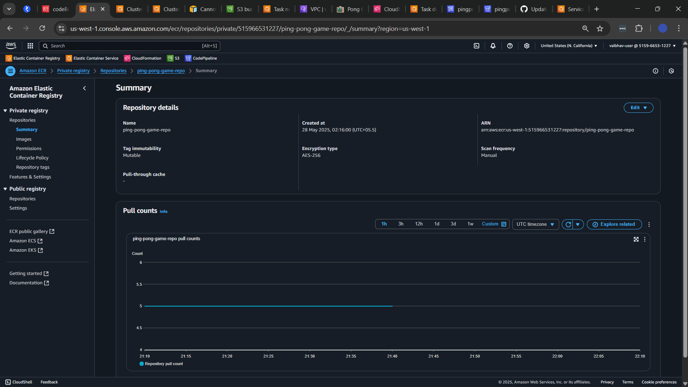

ce code
- The `Dockerfile`
- The `buildspec.yml`
- Any other files related to your CI/CD setup

---

🎉 You've successfully set up and pushed your Ping Pong Game code to GitHub with a ready-to-go CI/CD pipeline using AWS services!
```

Here's your **complete and cleanly formatted guide** with updated names (replacing **2048** with **Ping Pong Game**), and **no content skipped**, exactly as per your request:

---

```
## 9 Set Up CodeBuild for Continuous Integration (CI) – Ping Pong Game

---

### ✅ STEPS TO BE PERFORMED:

1. Create an IAM Role for CodeBuild  
2. Create an S3 Bucket for Build Artifacts  
3. Create a CodeBuild Project  
4. Test the CodeBuild Project  

---

### 🔐 9.1 Create an IAM Role for CodeBuild

AWS services like CodeBuild need permissions to interact with **ECR**, **ECS**, **S3**, and **CodeBuild** itself.

#### ▶️ Go to the IAM Console:

- Navigate to the [IAM](https://console.aws.amazon.com/iam) section of the AWS console.

#### ▶️ Create a New IAM Role:

- Click **Create Role**  
- Choose **CodeBuild** as the **trusted entity type**

#### ▶️ Attach the Following Managed Policies:

- `AmazonEC2ContainerRegistryFullAccess`: Allows CodeBuild to interact with ECR  
- `AWSCodeBuildDeveloperAccess`: Grants CodeBuild access to build-related services  
- `AmazonS3FullAccess`: Grants read/write access to S3 buckets (for storing build artifacts)

#### ▶️ Name the Role:

- Example: `codeBuildServiceRole`  
- Click **Create Role**

---

####  Attach Inline Policy for ECS

1. Go to the role: `IAM > Roles > codeBuildServiceRole`
2. Click **Add permissions > Create inline policy**
3. Click on the **JSON** tab
4. Paste the following policy:

```json
{
  "Version": "2012-10-17",
  "Statement": [
    {
      "Effect": "Allow",
      "Action": [
        "ecs:UpdateService",
        "ecs:DescribeServices"
      ],
      "Resource": "<ENTER_YOUR_ECS_SERVICE_ARN>"
    }
  ]
}
```

<aside>📌  
You can get your `<ECS_SERVICE_ARN>` by navigating to:  
**ECS > Clusters > pingpong-game-cluster > Services > pingpong-service**  
</aside>

5. Click **Next**, give a name (e.g., `ECSAccessPolicy`), and **Create Policy**

---

### 🪣 9.2 Create a S3 Bucket for Build Artifacts

CodeBuild generates output files like Docker image metadata and logs. These are stored in an **S3 bucket** for later access.

#### ▶️ Steps:

1. Navigate to the [S3 Console](https://s3.console.aws.amazon.com/s3/)
2. Click **Create Bucket**
3. Name it something like: `pingpong-ci-cd-pipeline-artifacts`  
   (📌 Bucket name must be globally unique)
4. Keep the rest of the settings default  
5. Click **Create Bucket**

---

### 🔧 9.3 Create a CodeBuild Project

The CodeBuild project pulls your GitHub repo, builds the Docker image, and stores results in S3.

#### ▶️ Go to CodeBuild Console:

- Navigate to [CodeBuild Console](https://console.aws.amazon.com/codebuild/home)  
- Click **Create Build Project**

#### ▶️ Configure the Project:

- **Project Name**: `pingpong-game-build`
- **Source Provider**: Choose **GitHub**
- Click on **Manage default source credential**
  - Use **OAuth App** for Credential type
  - Use **CodeBuild** as service
- Select the GitHub repository created earlier

#### ▶️ Environment Settings:

- Keep other environment configs default
- **Service Role**: Choose **Existing Role** and select `codeBuildServiceRole` created earlier

#### ▶️ Buildspec Configuration:

- Select **Use a buildspec file**

#### ▶️ Artifacts Configuration:

- **Type**: Amazon S3
- **Bucket**: Choose `pingpong-ci-cd-pipeline-artifacts`
- Leave all other settings default

#### ▶️ Create the Build Project:

- Review all the settings  
- Click **Create Build Project**

---

### 🧪 9.4 Test the CodeBuild Project

#### ▶️ Start a Build:

- In CodeBuild console, select the project (`pingpong-game-build`)
- Click **Start Build** to trigger manually

#### ▶️ Verify Build Success:

- Monitor **Build Logs** to ensure:
  - Docker image is built
  - Image is pushed to **ECR**
- Check the **S3 bucket** to ensure:
  - `imagedefinitions.json` file is generated and uploaded successfully

---

🎉 You've now successfully set up **CodeBuild for CI** with your **Ping Pong Game** project!
```

Here is your fully preserved and cleanly formatted version of **"Set up CodePipeline for Continuous Deployment"** – adapted for **Ping Pong Game**, and with **no content skipped**:

---

```
## 🚀 10. Set Up CodePipeline for Continuous Deployment – Ping Pong Game

---

### ✅ STEPS TO BE PERFORMED:

1. Create an AWS CodePipeline  
2. Test the Pipeline  

---

### 🏗️ 10.1 Create an AWS CodePipeline

AWS CodePipeline connects different stages of your CI/CD process. We'll define how updates in your GitHub repo will trigger builds and deployments to ECS.

---

#### ▶️ Step 1: Navigate to CodePipeline Console

- Go to [AWS Management Console](https://console.aws.amazon.com/)  
- Search for **CodePipeline** in the search bar  
- Click to open the **CodePipeline Console**

---

#### ▶️ Step 2: Create a New Pipeline

- Click **Create pipeline**  
- Choose **Build your own pipeline**  
- Click **Next**

##### 🔧 Pipeline Configuration:

- **Pipeline name**: `pingpong-game-pipeline`  
- **Service Role**: Select **Create a new service role**  
- **Role name**: `codePipelineServiceRole`  
- Click **Next**

---

#### ▶️ Step 3: Add Source Stage (GitHub)

This step tells CodePipeline where to pull the latest source code.

##### 🔧 Source Configuration:

- **Source Provider**: GitHub (via OAuth App)  
- Click **Connect to GitHub**  
  - Authorize AWS to access your GitHub account (if not already done)  
- **Repository**: Select your GitHub repo for Ping Pong Game  
- **Branch**: Select `main`  
- Click **Next**

---

#### ▶️ Step 4: Add Build Stage (CodeBuild)

CodeBuild will build and test the application.

##### 🔧 Build Configuration:

- **Build Provider**: AWS CodeBuild  
- **Project Name**: Select the project you created earlier (e.g., `pingpong-game-build`)  
- Leave other options as default  
- Click **Next**
- Skip test stage 

---

#### ▶️ Step 5: Add Deploy Stage (ECS Deployment)

Once built, the app is deployed to Amazon ECS automatically.

##### 🔧 Deploy Configuration:

- **Deploy Provider**: Amazon ECS  
- **Cluster**: Select your ECS Cluster (e.g., `pingpong-game-cluster`)  
- **Service**: Select your ECS Service (e.g., `pingpong-service`)  
- Leave the rest as default  
- Click **Next**

---

#### ▶️ Step 6: Review and Create Pipeline

- **Review all stages**: Source → Build → Deploy  
- If everything looks correct, click **Create pipeline**

📌 The pipeline will immediately begin running and execute each stage.

---

### 🧪 10.2 Test the Pipeline

Now let's test if the CI/CD pipeline works end-to-end.

---

#### ▶️ Step 1: Modify the Website Code

Update the game title in the frontend.

- Open `index.html`  
- Find the line(23) with:  <div class="game-title">Ping Pong</div>
- replace game name "Ping Pong" with your name "XYZ"
- save changes
 

---

#### ▶️ Step 2: Commit and Push the Change

Run the following commands in your terminal:

```bash
git add .
git commit -m "Changed game name to Ping Pong by YourName"
git push -u origin main
```

📌 Make sure you're on the `main` branch.

---

#### ▶️ Step 3: Monitor the Pipeline Execution

- Go to the **CodePipeline Console**
- Your pipeline (`pingpong-game-pipeline`) should automatically trigger
- Stages will run as follows:
  - **Source**: Pulls code from GitHub
  - **Build**: Runs `buildspec.yml`, builds image, pushes to ECR
  - **Deploy**: Deploys the latest image to ECS

📋 Monitor logs for each stage. If errors occur, check logs for more details.

---

#### ▶️ Step 4: Verify the Deployment

- Go to **ECS > Clusters > pingpong-game-cluster > Tasks tab**
- Click the latest **Task**
- Go to **Networking tab** and copy the **Public IP Address**
- Open your browser and go to:

```
http://<public_ip>:80
```
---

🎉 Congratulations! You've successfully set up a complete CI/CD pipeline for your **Ping Pong Game** using **AWS CodePipeline, ECS, ECR, S3, and CodeBuild**!


#### Screenshots

1) ECS Cluster


2) ECR Repository


3) Project build with help of AWS CodeBuild


4) S3 Bucket for Artifacts


5) Codepipeline [Source, Build, Deploy] Running on AWS Codepipeline


6) Deployed Ping Pong Game
